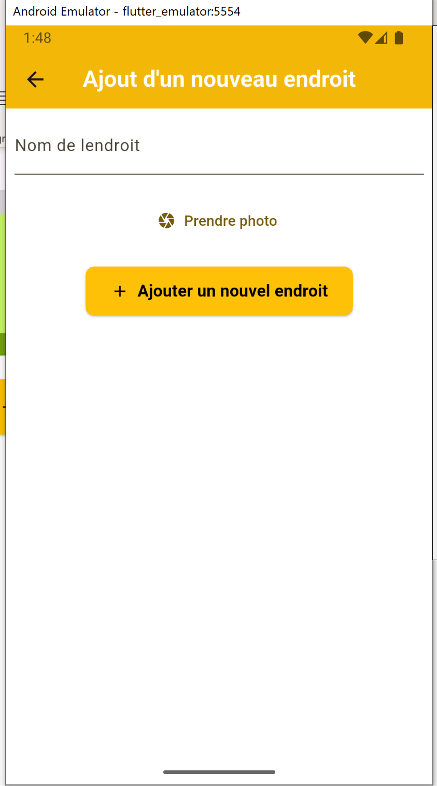
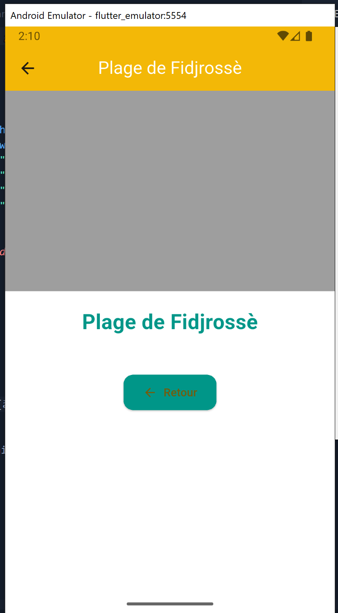
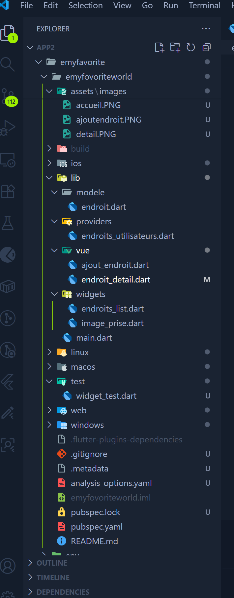

# emyfovoriteworld

# 🎯 eMyFovoriteWorld
#  
Une application Flutter de gestion d'endroits favoris. L'application permettra à l'utilisateur d'ajouter des endroits préférés avec des noms et des images, de les afficher dans une liste et de voir les détails de chaque endroit.  

Suite à ce projet vous aurez la possibilité :
-	Apprendre à intégrer des packages dans votre application mobile comme les packages uuid, riverpod et image_picker.
-	De maitriser la gestion d’état d’une application Flutter grâce à Riverpod.
-	D’utiliser la caméra dans une application Flutter grâce au package image_picker.
-	De maitriser l’utilisation des Widgets Statefull et de maitriser aussi le contrôle des données.

eMyFavoriteWorld est une application mobile développée avec Flutter et Dart, permettant à l’utilisateur de gérer et mémoriser ses endroits préférés à travers une interface simple, moderne et interactive.

Elle offre la possibilité d’ajouter un lieu avec :

une photo prise avec la caméra ou choisie depuis la galerie 📸

la géolocalisation automatique de l’endroit via Google Maps / GPS 📍

une description et un titre personnalisé 🏷️

et une sauvegarde locale persistante grâce à SQLite 💾

L’application se base sur une architecture réactive et propre, avec la gestion d’état assurée par Riverpod pour une meilleure performance et évolutivité.

## 🖼️ Aperçu du Projet

  
  
  

> *Aperçu rapide de l’interface principale, du menu et des écrans clés de l’application.*

 

## 🚀 Fonctionnalités principales

- 📱 Accueil: Affichage de la liste des endroits
Liste déroulante avec nom et image miniature.
En cas de liste vide, un message invitant à ajouter un endroit s’affiche
- 📱 Ajout endroit: Ajout d’un endroit

L’utilisateur entre un nom et une description.

Il choisit une photo :

soit en la prenant avec la caméra,

soit en la choisissant depuis la galerie[à venir ].

L’app récupère automatiquement la localisation GPS du lieu[à venir ].

Les données sont enregistrées dans la base locale SQLite.
- Détails d’un endroit

Affiche la photo complète. 

Montre les informations détaillées : nom, description[à venir ], coordonnées GPS[à venir ].

Possibilité d’ouvrir Google Maps pour visualiser le lieu exact[à venir ].
- Stockage local (SQLite) [à venir ]

Tous les endroits sont stockés dans une base locale persistante.

À chaque démarrage, l’application charge les données depuis SQLite.

Ainsi, même sans connexion Internet, les données restent disponibles. [à venir ]

### 🛠️ Technologies utilisées

Technologie	et Rôle
Flutter (Dart)	Framework principal de développement mobile
Riverpod	Gestion d’état moderne, réactive et performante
Image Picker	Sélection ou capture de photos
Path & Path Provider	Sauvegarde des images dans la mémoire interne
Geolocator	Accès à la position GPS
SQLite (sqflite)	Stockage local persistant
Google Maps (optionnel)	Affichage cartographique des lieux
---

dependencies:
  flutter:
    sdk: flutter
  flutter_riverpod: ^3.0.0
  image_picker: ^1.1.0
  path: ^1.8.3
  path_provider: ^2.1.2
  geolocator: ^10.1.0
  sqflite: ^2.3.0
  google_maps_flutter: ^2.5.0

  📸 Illustration du flux utilisateur

1️⃣ L’utilisateur ouvre l’application → voit la liste de ses endroits.
2️⃣ Il clique sur “Ajouter un nouvel endroit”.
3️⃣ Il remplit le formulaire → choisit une image ou prend une photo → la position GPS est récupérée.
4️⃣ Il valide → le nouvel endroit est ajouté à la liste et sauvegardé localement.
5️⃣ Il peut ensuite consulter les détails de chaque endroit ou l’afficher sur une carte.

🧑‍💻 Compétences mises en œuvre

Développement mobile Flutter (architecture MVC + Provider)

Manipulation des fichiers et des images

Gestion d’état réactive avec Riverpod

Stockage locale des données (SQLite)

Utilisation des permissions Android/iOS

Intégration d’API natives (géolocalisation, caméra, stockage)
\

Perspectives d’amélioration

🔐 Authentification utilisateur (Firebase Auth)

☁️ Synchronisation cloud (Firebase / Supabase)

🗺️ Intégration complète de Google Maps interactive

🧭 Partage des lieux favoris avec d’autres utilisateurs

🎨 Thème sombre et personnalisation UI

## ⚙️ Installation & Exécution

### 1️⃣ Cloner le dépôt

git clone https://github.com/elegbede01/eMyFavoriteWorld.git 

### 2️⃣ Se déplacer dans le projet 

# cd ton-repo 

### 3️⃣ Installer les dépendances

flutter pub get 

### 4️⃣ Lancer l’application

flutter run

👨‍💻 Auteur
Ir Joseph ELEGBEDE
💼 Développeur mobile et web  & analyste en Cybersécurité
📍 Bénin
🌐 LinkedIn: https://www.linkedin.com/in/joseph-elegbede-987998186/ 
 | GitHub: https://github.com/elegbede01 
